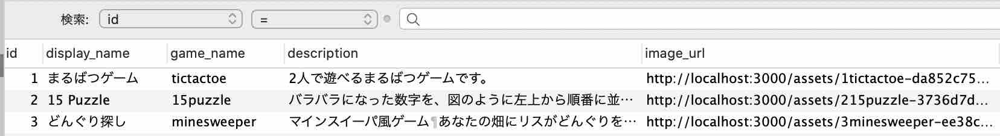
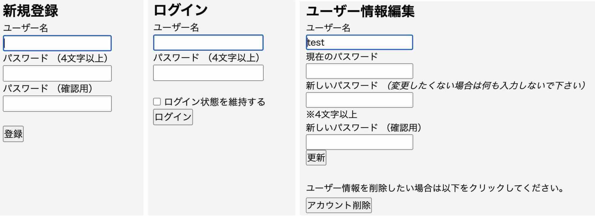
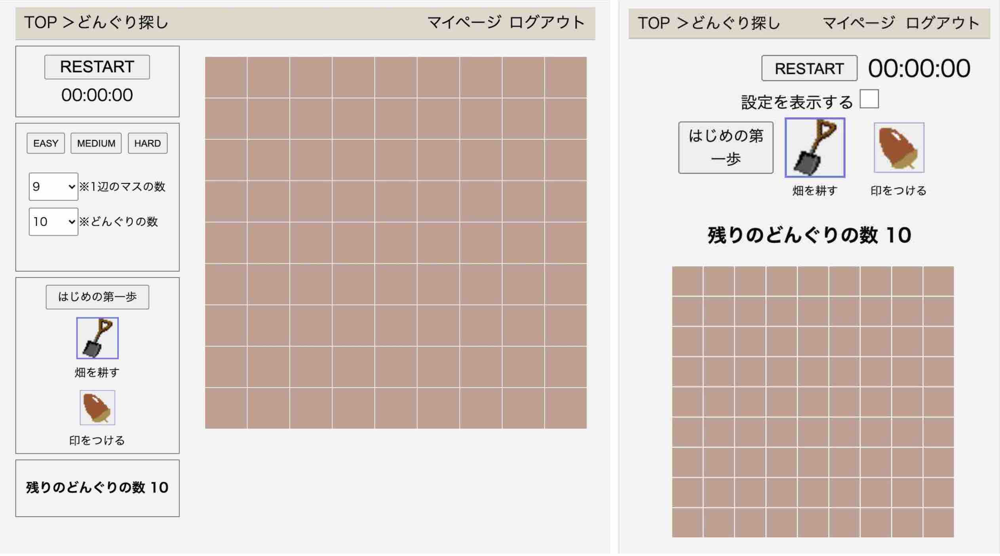
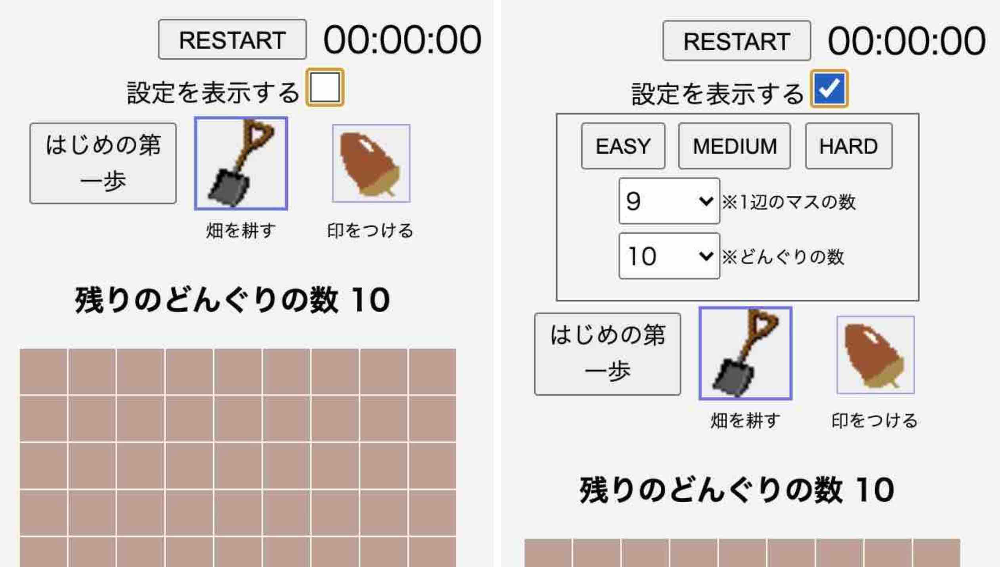
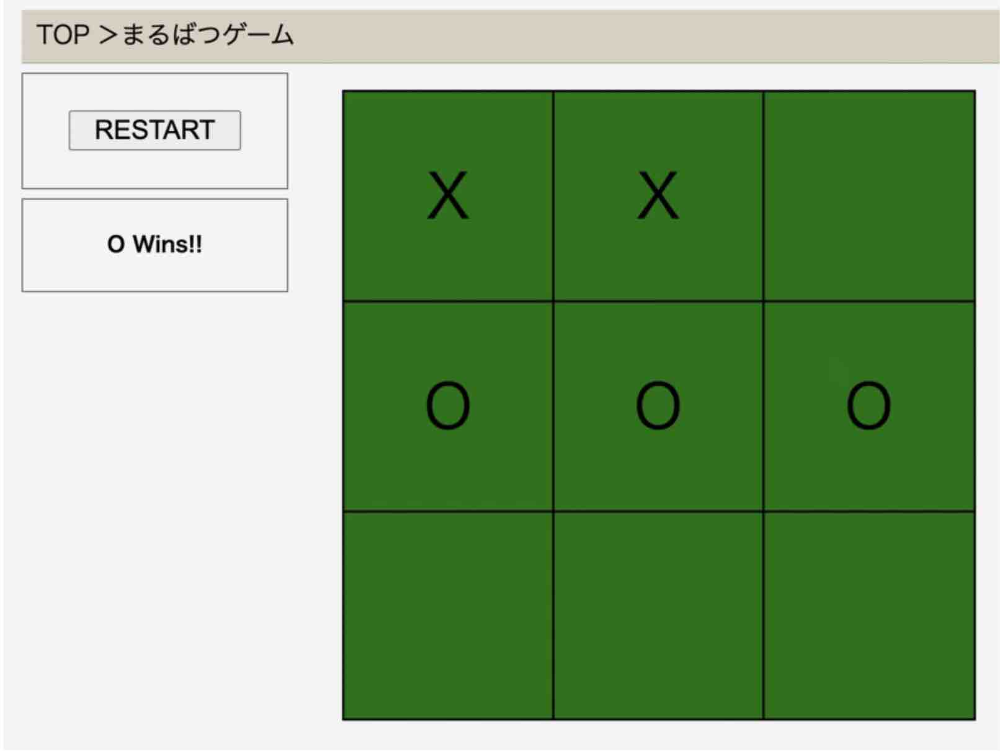
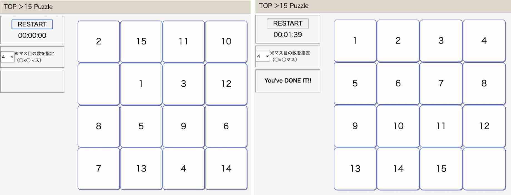
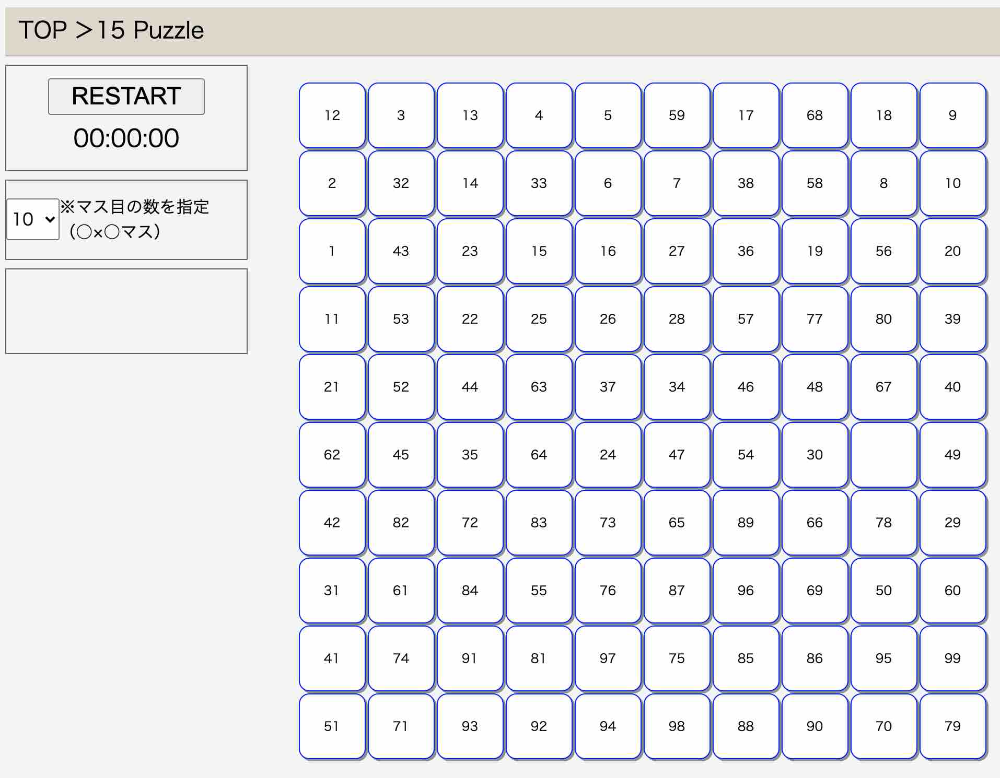
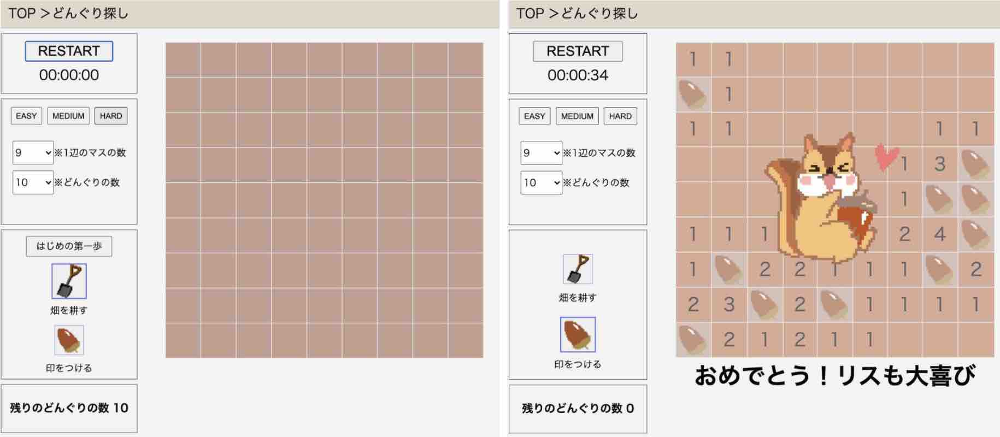
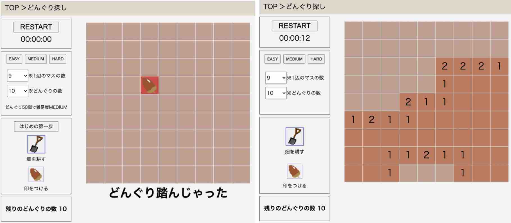
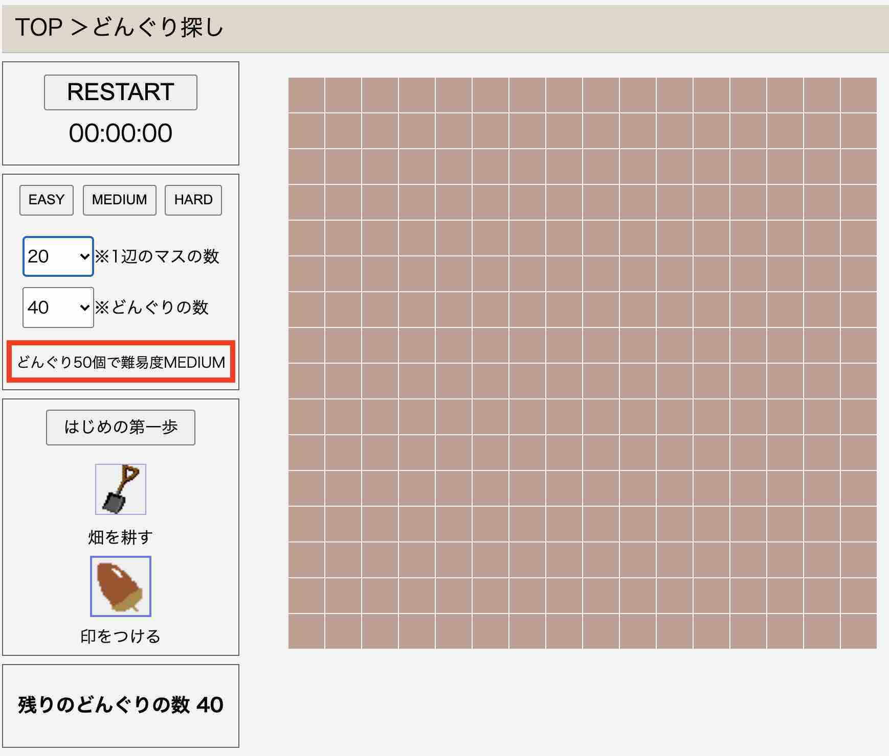

# 「LynxLevin's Game Land」概要

数字を使ったパズルやマインスイーパなどのシンプルなゲームを  
ブラウザ上で気軽に楽しめます。

## URL
http://54.250.80.22/

## テスト用アカウント
ユーザー名: test  
パスワード: test

## 利用方法
遊びたいゲームをクリックし、プレイして下さい。  
ユーザー登録なしでも遊べる仕様にしております。

## 解決したい課題
昨今のコンピュータやシステムの進化により、ゲームはとても魅力的に、そして複雑にもなりました。  
その一方で、昔のシンプルなゲームに喜びを感じる方々も一定数いらっしゃいます。  
そんな方々がちょっとした時間に気軽に、ストレスなく遊んだり、  
秋の夜長にじっくり没頭したりできるような、  
そんなゲームを目指し、現代にも輝くシンプルゲームサイトを作っていきます。

## 要件定義
https://docs.google.com/spreadsheets/d/1Z-VuONBD2F42nqNpe_3i8dkBSrBTvDsQ0C7GzcpBBrk/edit#gid=282075926

<br>

# 実装した機能と特徴
## 実装内容
洗い出した課題の中から、以下を実装しました。それぞれの仕様を紹介します。
- Ruby on Railsによるアプリ制作
- 最低限のユーザー管理機能
- レスポンシブデザイン
- まるばつゲーム
- 15 Puzzle（盤面サイズの設定機能、クリアタイム機能）
- どんぐり探し（盤面サイズの設定機能、どんぐりの数の設定機能、難易度ボタン機能、どんぐりの数の示唆機能、はじめの第一歩機能、クリアタイム機能）

## ・Ruby on Railsによるアプリ制作
アプリの開発コストを抑え、ゲーム画面デザインの統一化を図るためにRuby on Railsを使用してアプリ制作を行いました。  
　それぞれのゲームは1つのHTMLを共有し、元々非表示に設定をしている項目のうち、必要な項目をJavaScript表示させ、JavaScriptで動作をします。  
　各ゲームはデータベースの1レコードとして登録し、トップページに表示を行い、それぞれのURLを認識して該当のJavaScriptが動作する設計にしております。



（データベースのgameテーブルの内容）  

## ・ユーザー管理機能
気軽に遊べるシンプルなゲームサイトをコンセプトにしているため、ユーザー登録やログイン無しでも遊べるように作成をしております。  
　ですが、今後実装予定の自己ベストタイムを表示する機能の実装に向け、個人情報を使用しないユーザー管理機能を実装しております。 



（左：新規登録画面　中：ログイン画面　右：ユーザー情報編集画面）  

## ・レスポンシブデザイン
こちらのURL（ http://54.250.80.22/games/minesweeper ）よりご覧いただけます。  
　PCからでも、スマートフォンからでもストレスなくプレイできるよう、上図のようにレスポンシブデザインで作成をしております。



（左：PC画面　右：スマートフォン画面）  

　また、スマートフォン上で「設定を表示する」のチェックボックスのオン・オフを切り替えることで、ゲームプレイ中には必要のない設定ボタン*の表示・非表示を切り替えできる機能もCSSで実装しております。



（左：非表示　右：表示）  

## ・まるばつゲーム
こちらのURL（ http://54.250.80.22/games/tictactoe ）からご覧いただけます。  
　JavaScriptで3マス四方の盤面を表示し、マスをクリックするとOとXを交互に表示して、どちらかが1列揃うと勝者の宣言をする機能です。  
　書籍を参考に、Canvasを使用せずに、HTMLのtable要素を活用することで盤面を表示して扱う方法を学びました。その後、交互にOとXを表示させる方法と勝者の判定をさせる方法は自分で工夫し、実装しました。  
　技術的な課題として、3マス四方でしか使えない勝者判定の方法をとっていることがあります。特に動作上の支障はありませんが、より良いコードにするために、今後改良を行いたいと思っております。



（まるばつゲームプレイ画像）  

## ・15 Puzzle
こちらのURL（ http://54.250.80.22/games/15puzzle ）からご覧いただけます。  
　STARTボタンをクリックすることで、まるばつゲームと同様の方法で盤面を生成し、1から15までの数字を表示後、一定回数マスを並び替えます。その後、空白マスと同じ列または行のマスをクリックすることで、数字のマスを移動させ、1から15までを順に並べるゲームです。クリア後画面の状態になると、クリアメッセージ「You’ve DONE IT!!」が表示され、タイマーが止まるようになっています。  
　現状、マス目の数を増やした際にマスが極端に小さくなり、「プレイがしづらいこと」および「マスの形が崩れてしまうこと」が解決したい課題と考えております。



（左：プレイ開始時画面　右：クリア後画面）  

　このゲームの基礎的なコードは書籍にあるものを参考にしましたが、ユーザーの遊びやすさを考慮し、以下の機能を自分で工夫して実装しております。  
- 一度に複数のマスを動かす機能（例：上図プレイ開始時画面で12をクリックした場合、1、3、12の3マスが同時に動く機能）
- 盤面サイズの設定機能（例：数のように、盤面のサイズを自由に設定できる機能）
- ゲームクリアの判定機能
- クリアタイムの計測機能


（盤面サイズを10マス四方に設定した画面）  

## ・どんぐり探し
こちらのURL（ http://54.250.80.22/games/minesweeper ）からご覧いただけます。  
　マインスイーパー風のゲームで、STARTボタンをクリックすることで盤面を生成し、盤面をクリックすることで近くのどんぐり（地雷）の数を示した数字が現れ、どんぐりのある箇所に印を付けていくゲームです。地雷の負のイメージを除くため、リスが埋めたどんぐりを避けつつ畑を耕す、という設定にしています。


（左：ゲーム開始時画面　右：クリア後画面）  

　こちらは、以前からロジックが気になっていたために、完全に自力で制作したもので、以下のようなロジックです。  
1. まるばつゲームと同様の方法で盤面を生成
  　（各マスのHTML要素を配列で管理）
2. どんぐりを生成する位置を乱数で決め、該当マスに非表示の文字AをHTMLに記述。
3. 隣接するどんぐりの数を数え、それぞれのマスに非表示の数字を記述。
4. A：クリックしたマスがどんぐり（A）ならゲームオーバー。  
B：クリックしたマスが数字なら、そのマスのみ数字を表示。  
C：クリックしたマスが空白（隣接マスにどんぐりがない）なら、数字マスに行き当たるまで全てのマスを表示。
5. ：残りのどんぐりの数が０になり、全てのマスが表示されていればクリア。

　その他には、以下の機能を実装しております。
- はじめの第一歩機能  
（一手目からゲームオーバーになることを防ぐために、１回のみ空白マスを自動で開く機能）
- 盤面サイズの設定機能
- どんぐりの数の設定機能
- クリアタイムの計測機能
- 難易度ボタン機能
- どんぐりの数の示唆機能  
（盤面サイズを変更した場合、どんぐりの数の設定目安の表示）



（左：一手目でゲームオーバーになる例　右：はじめの第一歩機能の例）  



（どんぐりの数の示唆機能）  

現状、空白マスが多すぎる場合、マスを開く動作の途中でJavaScriptが停止してしまうので、マスを開く動作ロジックの改善を図りたいと思っております。


## 実装予定の機能
- クリアタイム保存機能（難易度別）
- ベストタイム表示機能（難易度別）
- ベストタイム表示機能（各種設定別）
- ベストタイム表示機能（マイページ）
- ベストタイム表示機能（非ログインユーザー）
- 遊び方表示機能
- （ゲーム）2048
- （ゲーム）テトリス

<br>

# データベース設計

## users テーブル
| Columns  | Type   | Options                       |
| -------- | ------ | ----------------------------- |
| username | string | null: false, uniqueness: true |
| email    | string |                               |
| password | string | null: false                   |

### Association

## games テーブル
| Columns      | Type   | Options                       |
| ------------ | ------ | ----------------------------- |
| display_name | string | null: false, uniqueness: true |
| game_name    | string | null: false, uniqueness: true |
| description  | text   |                               |
| image_url    | string |                               |

### Association

<br>

# ローカル環境での動作方法
ターミナルで以下の通りにコマンド入力してください。
s（Ruby on Railsのバージョン6.0.0でせい作成ています。）
1. 任意のディレクトリを開きます。
※「~/repositories」の部分は任意のディレクトリを指定します。
```
cd ~/repositories
```

2. リポジトリをクローンします。

```
git clone https://github.com/lynxlevin/llgameland.git
```
3. llgamelandディレクトリに移動します。

```
cd llgameland
```

4. Gemをインストールします。

```
bundle install
```

5. JavaScriptのパッケージをインストール

```
yarn install
```

6. データベースを生成します。

```
rails db:migrate
```

7. データベースにデータを登録します。

```
rails db:seed
```